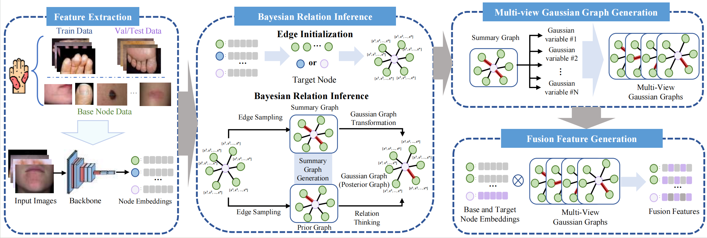

# BDC
## Bayesian Distribution calibration

The BDC_for_miniImagenet folder contains the main BDC code, which can be used directly on the _mini_Imagenet dataset. The Derm_preprocess folder contains the preprocessing code for the Derm dataset, in which split.py is used to divide the classes by name, and del_classes.py is used to delete the categories with insufficient data.
